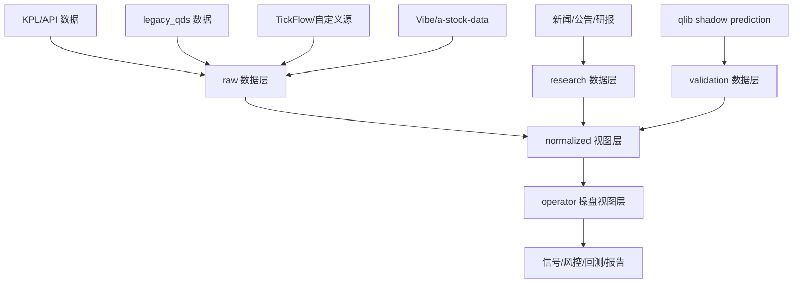

# Phase 11 多项目整合研究与实施方案

生成时间：2026-07-07

主项目：`D:\accio\stock_data`

外部项目：

- `D:\accio\A-share\kpl-qds`
- `shy3130/tickflow-stock-panel`
- `simonlin1212/Vibe-Research`

角色标准：职业操盘手 + 量化交易系统架构师 + 投研系统产品经理

## 0. 结论先行

`stock_data` 已经不是空项目，而是一个具备“第一版可运行闭环”的 A 股短线/题材/情绪周期辅助系统：有 DuckDB 数据底座、标准化视图、信号层、风控表、回测报告、职业操盘 HTML 报告和集成日跑入口。

但它距离职业操盘可用还有关键缺口：

- 竞价链路仍不够真实：`auction_bidding_anomaly` 有少量数据，`auction_tick` 为 0，无法支撑真实 9:15-9:25 阶段强弱确认。
- 指数与 K 线历史不足：`kline` 有 403 行，`index_kline` 为 0，分阶段回测样本仍偏薄。
- 风控快照未形成连续时间序列：`risk_snapshot` 为 0，无法做稳定的仓位状态追踪。
- 当前 HTML 操盘台偏“结果报告”，还不是“盘前-竞价-盘中-尾盘-盘后”的操作面板。
- 外部资讯、公告、研报、研究记录尚未纳入统一复盘归因。
- qlib 只能 shadow mode，不能直接成为实盘信号来源。

推荐路线是路线 B：`stock_data` 保持主内核，吸收 tickflow 的策略/回测/监控思想，吸收 Vibe-Research 的资讯/研报/AI 复盘/研究记录，吸收 `kpl-qds` 的 legacy 数据和已验证模块思想，qlib 以 shadow mode 接入，先增强报告和 HTML 操盘台，而不是立刻重建 FastAPI + React。

## 1. 本轮边界

本轮只做研究、审计、分析和方案。

不做：

- 不写业务代码。
- 不改数据库。
- 不删除任何项目。
- 不修改 `.env`。
- 不输出或复制任何 key。
- 不引入自动下单。
- 不把外部项目整包复制进 `stock_data`。

允许做：

- 读取代码、文档、数据库结构和报告。
- 只读方式检查 DuckDB。
- 检查测试可运行性。
- 阅读 GitHub README、docs、LICENSE 和源码结构。
- 保存本方案文档。

## 2. `stock_data` 当前真实状态审计

### 2.1 项目结构

核心目录和文件：

- `D:\accio\stock_data\trade_system`
- `D:\accio\stock_data\scripts`
- `D:\accio\stock_data\tests`
- `D:\accio\stock_data\reports`
- `D:\accio\stock_data\kpl_data.duckdb`
- `D:\accio\stock_data\schema.py`
- `D:\accio\stock_data\trading_data_application.md`

关键模块：

- `trade_system.signals`：市场情绪、板块评分、候选股信号。
- `trade_system.risk`：风险告警。
- `trade_system.operator_risk`：操盘风控扩展。
- `trade_system.operator_backtest`：操盘候选回测。
- `trade_system.auction_deep`：竞价深度适配。
- `trade_system.integration.legacy_a_share`：A-share legacy 数据导入。
- `trade_system.integration.operator_views`：统一操盘视图。
- `trade_system.web_report`：HTML 操盘报告。
- `scripts.run_integrated_daily`：一键日跑入口。

### 2.2 最新测试状态

本轮重新运行测试，结果：

```text
43 passed in 3.26s
```

这说明当前代码闭环可运行，但不能等同于“职业级实盘可用”。它只能证明当前测试覆盖到的采集、视图、信号、风险、回测、报告入口没有破裂。

### 2.3 报告状态

`D:\accio\stock_data\reports` 中存在且非空的关键报告：

- `data_quality_latest.md`
- `schema_audit_latest.md`
- `data_chain_status_latest.md`
- `integration_audit_latest.md`
- `legacy_import_latest.md`
- `market_status_latest.md`
- `sector_mainline_latest.md`
- `candidate_stocks_latest.md`
- `risk_alerts_latest.md`
- `backtest_latest.md`
- `stage_backtest_latest.md`
- `operator_backtest_latest.md`
- `daily_trading_report_latest.md`
- `trading_dashboard_latest.html`

当前报告覆盖了数据质量、市场状态、题材主线、候选股、风险告警、回测、日度操盘台。

### 2.4 数据库状态

只读审计 `D:\accio\stock_data\kpl_data.duckdb`：

- 表：213
- 视图：12

核心表/视图样本：

| 对象 | 类型 | 行数 | 判断 |
|---|---:|---:|---|
| `v_market_daily` | view | 250 | 可用于市场输入 |
| `v_sector_daily` | view | 58 | 可用于题材/板块观察 |
| `v_limit_pool` | view | 64 | 可用于情绪和涨停池 |
| `v_lhb_daily` | view | 93 | 可用于龙虎榜样本 |
| `v_stock_pool` | view | 71 | 可用于候选池 |
| `v_auction_status` | view | 3 | 有竞价摘要，但样本很少 |
| `v_sector_capital` | view | 16 | 有板块资金雏形 |
| `v_kline_daily` | view | 370 | 有 K 线视图，但历史不足 |
| `v_market_state_inputs` | view | 250 | 可支撑市场状态 |
| `v_index_state` | view | 4 | 指数状态非常薄 |
| `v_data_coverage` | view | 213 | 可用于数据覆盖度审计 |
| `v_operator_candidates` | view | 489 | 操盘候选统一视图 |

关键物理表：

| 表 | 行数 | 判断 |
|---|---:|---|
| `auction_bidding_anomaly` | 3 | 有竞价异动样本，但不足 |
| `auction_tick` | 0 | 真实竞价 tick 缺失 |
| `advanced_morning_bidding_summary` | 5 | 有竞价摘要样本 |
| `sector_capital` | 16 | 有板块资金雏形 |
| `kline` | 403 | K 线样本不足 |
| `index_kline` | 0 | 指数 K 线缺失 |
| `l2_realtime_index_list` | 4 | L2 指数/盘口辅助样本极少 |
| `l2_stock_intraday` | 4820 | 有盘中盘口类数据 |
| `l2_stock_bigorder` | 2472 | 有大单样本 |
| `stock_candidate_stage_signal` | 284 | 四阶段候选信号已有雏形 |
| `legacy_qds_daily_watchlist` | 205 | 已吸收 A-share watchlist |
| `market_regime_snapshot` | 1 | 市场状态快照样本不足 |
| `sector_rotation_score` | 16 | 板块轮动评分雏形 |
| `alert_events` | 2 | 风险事件样本很少 |
| `risk_snapshot` | 0 | 风控快照未形成 |

### 2.5 已完成能力

已经可用：

- 数据质量审计。
- schema 审计。
- A-share legacy 数据导入。
- 标准化视图。
- 操盘统一视图。
- 市场状态信号。
- 板块主线评分。
- 候选股信号。
- 风险告警。
- 操盘风控表结构。
- 操盘回测和阶段回测雏形。
- HTML 操盘报告。
- 一键集成日跑。

### 2.6 当前缺口

从职业操盘角度，缺口按优先级排列：

1. 真实竞价链路不足：需要 9:15-9:25 竞价 tick、撤单强度、封单变化、竞价金额、竞价涨幅、竞价确认结果。
2. 指数/K 线历史不足：需要指数、个股、板块的稳定历史，用于分阶段回测和市场状态判断。
3. 板块资金还薄：需要主线强度、资金流向、封板率、炸板率、梯队结构联动。
4. 风控快照缺失：需要市场状态到仓位约束的每日/盘中快照。
5. 四阶段候选股仍需回测验证：盘前池、竞价确认、盘中强弱、尾盘去留需要分别统计样本。
6. 资讯/公告/研报尚未接入：无法把题材催化、风险事件、龙虎榜、公告和操盘结果做归因。
7. qlib/机器学习尚无验证闭环：只能作为旁路验证，不能作为交易信号主线。
8. UI 还只是静态报告，不是完整操作台。

## 3. `D:\accio\A-share\kpl-qds` 审计

### 3.1 项目结构

关键目录：

- `agent-core`
- `config`
- `dashboard`
- `db`
- `docs`
- `engine`
- `monitoring`
- `qlib_data`
- `qlib_ext`
- `reports`
- `scheduler`
- `scripts`
- `tests`

关键模块：

- `engine.signal_fusion`
- `engine.qstock_selector`
- `engine.risk_enforcer`
- `engine.auction_analyzer`
- `engine.performance_tracker`
- `engine.backtester`
- `engine.qmt_bridge`
- `dashboard`
- `qlib_ext.alpha200_handler`
- `qlib_ext.inference_pipeline`
- `qlib_ext.model_trainer`
- `qlib_ext.onnx_export`

### 3.2 数据库状态

只读审计 `D:\accio\A-share\kpl-qds\db\kpl_qds.duckdb`：

| 表 | 行数 | 判断 |
|---|---:|---|
| `daily_watchlist` | 205 | 已经导入 `stock_data`，价值较高 |
| `limit_up_stocks` | 2640 | 可继续用于涨停池历史补充 |
| `sector_capital_flow` | 368 | 可用于板块资金补充 |
| `sector_strength` | 390 | 可用于板块强度补充 |
| `stock_capital_flow` | 3588 | 可用于个股资金补充 |
| `daily_sentiment` | 27 | 可用于情绪周期补充 |
| `intraday_signals` | 15 | 样本少，只能参考 |
| `kpl_ladder_stocks` | 238 | 可用于梯队结构 |
| `lhb_detail` | 912 | 可补龙虎榜细节 |
| `auction_snapshots` | 0 | 无有效竞价快照 |
| `auction_analysis` | 0 | 无有效竞价分析 |
| `l2_snapshots` | 0 | 无有效 L2 快照 |

补充数据库：

- `bs_data.duckdb`：`bs_stock_daily` 约 10018 行，可评估是否用于基础日线补样。
- `ffd_data.duckdb`：无有效表。

### 3.3 已导入是否足够

已导入 `stock_data` 的 legacy 数据足以支撑第一版统一视图和候选池融合，但不够支撑职业级交易：

- watchlist 已可用。
- 涨停、板块资金、板块强度、龙虎榜、个股资金还有继续吸收价值。
- 竞价和 L2 在 `kpl-qds` 内本身为空，不能指望它补齐真实盘口。

### 3.4 有价值但尚未充分吸收的模块

建议吸收方式不是直接复制，而是重写为 `stock_data` adapter 或模型思想。

| 模块 | 价值 | 建议 |
|---|---|---|
| `signal_fusion` | 多信号融合思想 | 迁移为可解释 evidence scoring，不直接导入依赖 |
| `qstock_selector` | 选股流程和 TA fallback | 参考其候选过滤思想，必须重写 |
| `risk_enforcer` | 仓位/风险规则 | 抽象为 `stock_data` 风控约束和快照 |
| `auction_analyzer` | 竞价分析规则 | 参考字段和规则，但真实数据需另补 |
| `performance_tracker` | 持仓/操作归因 | 迁移为复盘归因层 |
| `dashboard` | 页面组织 | 参考，不迁移 UI 框架 |
| `qlib_ext` | Alpha/模型流水线 | 只做 shadow mode 接口 |

### 3.5 不应引入的部分

必须禁止：

- `qmt_bridge` 自动交易/下单路径。
- 硬编码 key 和含敏感配置的 settings。
- 未训练模型直接参与信号。
- qlib 重型二进制数据直接进入主项目仓库。
- 依赖不稳定、未纳入 `stock_data` 测试的模块直接 import。

### 3.6 qlib 的接入判断

`kpl-qds` 文档里已有明确事实：Alpha158 在 16GB 内存环境下存在多进程/内存问题，项目曾改用轻量 pandas 引擎。当前 qlib 相关测试在本环境中也因缺少 `qlib`、`loguru` 等依赖无法直接收集。

因此 qlib 接入原则：

- 不在 `stock_data` 主流程内训练大模型。
- 不把 qlib 分数直接作为买入/卖出信号。
- 只接收外部生成的预测结果表。
- 只做 shadow score、分层统计、IC/RankIC/命中率评估。
- 只有连续样本验证后，才允许作为“旁路证据”，且权重必须可配置、可回测、可关闭。

## 4. `tickflow-stock-panel` 研究

### 4.1 项目定位

`tickflow-stock-panel` 是一个自托管 A 股选股、监控和回测工作台。它的文档明确强调不是 AI 荐股工具，也不是涨停预测工具，而是策略筛选、监控和复盘平台。

本轮读取内容：

- README
- `docs/features.md`
- `docs/strategy.md`
- `docs/custom-data-source.md`
- `LICENSE`
- 后端结构
- 前端结构
- 策略、回测、监控、自定义数据源核心代码

审计版本：临时浅克隆 commit `5b2282f`。

许可证：MIT。

### 4.2 后端结构

后端核心：

- `backend/app/main.py`：FastAPI 入口。
- `backend/app/strategy/engine.py`：策略加载和执行。
- `backend/app/strategy/custom_signals.py`：自定义信号。
- `backend/app/strategy/monitor.py`：监控规则。
- `backend/app/strategy/builtin`：内置策略。
- `backend/app/backtest/engine.py`：组合回测引擎。
- `backend/app/backtest/strategy.py`：策略回测适配。
- `backend/app/indicators/pipeline.py`：Polars 指标流水线。
- `backend/app/data_providers/custom/provider.py`：自定义 HTTP 数据源。

依赖特点：

- Python 3.11+
- FastAPI
- Polars
- DuckDB
- PyArrow
- APScheduler
- 可选 vectorbt

### 4.3 前端结构

前端是 React + Vite + TypeScript，包含：

- Dashboard
- Screener
- Backtest
- Monitor
- Review
- LimitUpLadder
- ConceptAnalysis
- IndustryAnalysis
- Watchlist
- Settings

这套 UI 对长期方向有参考价值，但现在不建议整体迁入。原因：

- `stock_data` 当前优先级是数据和信号稳定。
- 直接迁入 React 工作台会扩大维护面。
- 两套后端和两套状态管理容易造成主项目失焦。

### 4.4 选股和指标流水线

tickflow 的优势：

- 用 Polars 做全市场向量化扫描。
- 指标 pipeline 覆盖 MA、EMA、MACD、RSI、KDJ、ATR、BOLL、量比、涨停信号、连板计数等。
- 策略文件有统一 `META`、`BASIC_FILTER`、`filter`、`filter_history`、`ENTRY_SIGNALS`、`EXIT_SIGNALS`、止损、最大持仓天数等结构。
- 策略结果可以被监控和回测复用。

适合迁入 `stock_data` 的不是代码包本身，而是“策略定义协议”和“向量化计算思路”。

### 4.5 回测系统

tickflow 回测能力对 `stock_data` 很有价值：

- 支持 T+1、手续费、印花税、滑点。
- 支持止损、止盈、移动止损。
- 支持最大持仓天数、最大持仓数、仓位上限、等权/按分数权重。
- 支持策略组合回测和自由信号组合。

`stock_data` 的四阶段候选股可以按 tickflow 思路扩展：

- 盘前池：用日线、板块、题材、涨停池、龙虎榜、资讯催化做候选。
- 竞价确认：用竞价金额、竞价涨幅、撤单、封单、弱转强确认。
- 盘中强弱：用盘口、L2、大单、板块强弱、分时承接。
- 尾盘去留：用收盘位置、板块延续、炸板/回封、风险事件和次日预期。

### 4.6 监控中心

tickflow 的 Monitor 对职业操盘有参考价值：

- 策略信号监控。
- 单股价格/信号监控。
- 市场异常监控。
- AND/OR 条件组合。
- 冷却时间。
- 飞书 webhook。
- 持久化告警日志。

`stock_data` 当前不应直接接入通知系统，但可以迁移规则结构：

- `monitor_rule`
- `monitor_event`
- `alert_event`
- `cooldown_until`
- `severity`
- `operator_action`

### 4.7 自定义数据源

tickflow 的 custom data source 提供了外部 HTTP 映射能力。文档主支持 daily、adj_factor、realtime，代码中可见 minute、financial 等扩展雏形。

对 `stock_data` 的价值：

- 把 KPL/API、Vibe/a-stock-data、未来自定义源统一成 adapter。
- 每个 adapter 声明字段映射、认证方式、速率、覆盖范围和失败策略。
- 不把外部源直接绑死到主 schema。

### 4.8 适合迁移、参考、不适合的部分

适合迁移：

- 策略定义协议。
- Polars/DuckDB 批量指标思想。
- 回测配置思想。
- 监控规则结构。
- 自定义数据源 adapter 思想。

只做参考：

- React 工作台。
- FastAPI 服务结构。
- 内置策略具体阈值。
- AI 生成策略机制。

不适合迁入：

- 整包前后端。
- 依赖 tickflow 包作为主系统硬依赖。
- 未经 A 股短线/题材验证的内置策略直接作为信号。
- 外部 webhook 通知默认开启。

## 5. `Vibe-Research` 研究

### 5.1 项目定位

`Vibe-Research` 是个人 AI 投研系统，覆盖 A 股、美股、港股。它的价值不在交易执行，而在资讯、研报、公告、研究记录、持仓复盘和 AI 问答层。

本轮读取内容：

- README
- `backend/README.md`
- `backend/app.py`
- `backend/newsradar.py`
- `backend/portfolio.py`
- `backend/myreports.py`
- `backend/mcp_server.py`
- `backend/news_sources.json`
- `a-stock-data/SKILL.md`
- `a-stock-data` README
- `global-stock-data` README/SKILL
- LICENSE

审计版本：临时浅克隆 commit `db97b9e`。

许可证：MIT。

### 5.2 后端数据层

Vibe 后端提供 FastAPI 接口，覆盖：

- 健康检查。
- AI chat。
- portfolio。
- myreports。
- radar。
- market overview。
- market emotion。
- turnover top。
- global indices。
- A 股 indices、quote、valuation、announcements、financials、reports、news、kline、finance、margin、block trade、holders、dividend、fund flow、dragon tiger、lockup、blocks、hot concepts、investor QA、industry。

依赖模式：

- 核心服务 FastAPI + requests。
- akshare、mootdx、pandas 等为可选重依赖。
- 缺失重依赖时部分接口返回 501，而不是整个服务崩溃。

这个“可选依赖降级”很适合 `stock_data`。

### 5.3 资讯雷达

`backend/newsradar.py` 的特点：

- 标准库 RSS 拉取。
- `news_sources.json` 定义行业/来源。
- 多线程抓取。
- 关键词红线过滤。
- 本地缓存到 `.cache/radar.json`。
- 不需要 key。

适合迁入 `stock_data`：

- 建立 `news_radar_item` 表。
- 建立 `risk_event_keyword` 表。
- 把新闻映射到题材、板块、个股和候选股。
- 在操盘报告里输出“催化/风险/隔夜事件”。

### 5.4 研报和公告

Vibe 的 `a-stock-data` 覆盖：

- 个股研报。
- 行业研报。
- PDF 下载。
- 公告。
- 财务摘要。
- 估值分位。
- 股东/分红/融资融券/大宗交易/龙虎榜。
- 热点概念、互动问答、热榜。

这些能力可以补 `stock_data` 的投研和复盘层，但不应该成为短线交易信号主引擎。

适合迁入：

- 研报/公告元数据表。
- 研究附件索引。
- 个股催化摘要。
- 题材证据字段。
- 复盘归因。

### 5.5 MCP 和 AI 接入

Vibe 的 `mcp_server.py` 是 JSON-RPC over stdio 的轻量 MCP 模式，提供查询 quote、valuation、reports、news 的工具结构。

对 `stock_data` 的价值：

- 后续可以把 `stock_data` 的 market status、candidate、risk、research note 暴露成本地工具。
- 但现阶段不应把 AI 作为实盘信号生成器。
- AI 适合做复盘总结、证据归纳、研究记录检索和报告摘要。

### 5.6 持仓和研究记录

Vibe 的 portfolio/myreports/notes 思路适合迁移：

- 持仓记录。
- 已清仓记录。
- 研究报告文件索引。
- 研究笔记。
- AI 总结。

`stock_data` 已有 trading plan、position snapshot、trade log 雏形，应吸收 Vibe 的“投研记录和附件管理”而不是重建整套投研网站。

### 5.7 a-stock-data 与 global-stock-data 判断

`a-stock-data` 适合补充 A 股数据：

- 腾讯/百度行情。
- 东方财富研报/公告/估值/资金流。
- 同花顺热点原因。
- 龙虎榜、解禁、融资融券、大宗交易、互动问答、热榜。

`global-stock-data` 不应进入主交易信号，只能作为隔夜外围参考：

- 美股/港股指数。
- 全球市场风险。
- 重要外围资产变动。

### 5.8 适合迁移、参考、不适合的部分

适合迁移：

- 资讯雷达。
- 新闻/公告/研报元数据。
- 研究记录。
- 持仓/已清仓复盘字段。
- MCP 工具思想。
- `a-stock-data` 的 A 股数据 adapter。

只做参考：

- 完整 FastAPI 路由。
- 完整前端页面。
- global-stock-data 的全市场结构。
- 通用 AI chat 页面。

不适合迁入：

- 把 Vibe 变成主交易信号系统。
- 把 AI chat 结论作为交易触发。
- 未验证的数据源直接写主表。
- 上传文件或 PDF 处理不加白名单和大小限制。

## 6. 职业操盘目标形态

### 6.1 数据层

目标数据层应分为 raw、normalized、operator、research、validation 五层。



应包含：

- KPL/API 数据：保持现有采集链路。
- legacy_qds 数据：继续作为历史补充，保留来源字段。
- TickFlow/custom 数据源：作为 adapter 协议，不直接依赖 tickflow 服务。
- Vibe/a-stock-data 补充数据：用于资讯、研报、公告、资金、龙虎榜、热点原因。
- qlib shadow prediction：只做旁路预测结果表。
- 新闻、公告、研报、研究记录：用于催化和复盘归因。

### 6.2 操盘信号层

目标信号层应从“粗规则打分”升级为“证据化分层信号”。

核心信号：

- 市场情绪周期：冰点、修复、主升、高潮、分歧、退潮。
- 赚钱效应：涨跌家数、涨停/跌停、连板高度、炸板率、封板率。
- 题材主线强度：板块涨幅、资金流、涨停梯队、热度、新闻催化。
- 板块资金：净流入、主力流入、分歧度、持续性。
- 集合竞价确认：竞价涨幅、竞价金额、匹配量、撤单、开盘承接。
- L2/盘口强弱：大单、主动买卖、分时承接、盘口异动。
- 四阶段候选股：
  - 盘前池。
  - 竞价确认。
  - 盘中强弱。
  - 尾盘去留。
- qlib/量化因子旁路验证：只显示 shadow score 和历史统计。
- 每条信号必须有：
  - `evidence_json`
  - `score_breakdown_json`
  - `selected_reason`
  - `risk_points`
  - `invalid_conditions`
  - `sample_stat_ref`

### 6.3 风控层

风控不只是风险提示，而是约束操作。

应包含：

- 市场状态仓位约束：退潮期降仓，冰点期只观察，主升期允许提高计划仓位。
- 个股仓位约束：单票上限、题材集中度上限、连板高度风险。
- 弱市场降级：信号满足但市场不支持时降级为观察。
- 黑名单/风险事件：监管、减持、业绩雷、公告异常、流动性风险。
- 操作计划与复盘归因：每笔计划有触发条件、失效条件、实际结果和归因。

### 6.4 回测与验证层

回测应围绕职业操作动作，而不是只看单一买点。

应包含：

- 四阶段候选股回测。
- 策略回测。
- qlib shadow 分数验证。
- 题材/板块样本统计。
- 盘前、竞价、盘中、尾盘分阶段胜率统计。
- 市场状态条件下的分层表现。
- 风控触发后的收益/回撤变化。

### 6.5 投研与复盘层

应吸收 Vibe 的优势：

- 新闻雷达。
- 公告/研报/财务摘要。
- AI 复盘。
- 研究记录。
- 操盘日志。
- 持仓与已清仓归因。
- 个股催化时间线。
- 题材发酵时间线。

AI 的定位：

- 允许做摘要、归因、对比、报告生成。
- 不允许直接生成买卖指令。
- 不允许替代回测统计。

### 6.6 操作界面

当前阶段不先做复杂前端。

优先增强：

- `reports/trading_dashboard_latest.html`
- 每日 Markdown 报告。
- 静态 HTML 操盘台。

页面必须服务：

- 盘前：市场状态、题材主线、候选池、风险事件。
- 竞价：竞价确认、弱转强、风险排除。
- 盘中：主线强弱、候选股强弱、L2/盘口、告警。
- 尾盘：去留、次日预期、仓位建议。
- 盘后：复盘、回测样本、归因、研究记录。

不做普通资讯门户，不做营销首页。

## 7. 三条整合路线

### 路线 A：保守整合

策略：

- 只把外部项目能力变成 `stock_data` 的数据源和报告增强。
- 不迁移策略系统。
- 不接 qlib。
- 不碰 UI 框架。

优点：

- 风险最低。
- 改动小。
- 不容易破坏现有闭环。

缺点：

- 职业操盘价值提升有限。
- 回测和监控仍偏弱。
- 外部项目最有价值的工程结构没有充分吸收。

适合场景：

- 只想快速补资讯、公告、研报。
- 暂时不做策略回测升级。

### 路线 B：推荐整合

策略：

- `stock_data` 保持主内核。
- 吸收 tickflow 的策略/回测/监控思想。
- 吸收 Vibe-Research 的资讯/研报/AI 复盘/研究记录。
- `kpl-qds` 继续作为 legacy 数据和规则思想来源。
- qlib 以 shadow mode 接入。
- 增强 HTML 操盘台。
- 所有外部能力通过 adapter、schema、视图、报告、插件化模块进入。

优点：

- 平衡速度、风险和职业交易价值。
- 不引入大规模前端重构。
- 能把数据、信号、回测、投研和复盘串起来。
- 保留 `stock_data` 的主线，最终可以淘汰旧项目。

缺点：

- 需要规范 adapter 和 capability registry。
- 需要逐阶段验证，否则容易变成资料堆砌。

适合场景：

- 当前项目已经有第一版闭环。
- 用户目标是尽快整合成可用系统，而不是展示型大平台。

### 路线 C：激进整合

策略：

- 在 `stock_data` 内重建 FastAPI + React 工作台。
- 深度迁入策略中心、监控中心、投研中心。
- 将 tickflow/Vibe 的前后端能力大规模融合。

优点：

- 长期界面体验最好。
- 可形成完整产品化工作台。

风险：

- 开发成本最高。
- 维护面急剧扩大。
- 数据和信号尚未稳定时做复杂 UI，会掩盖真实问题。
- 容易出现多个服务、多个依赖、多个状态源。

当前不推荐。

## 8. 推荐路线

推荐路线 B。

原因：

- `stock_data` 已经有可运行闭环，应保护它的主内核。
- 当前最缺的是数据真实性、信号解释性、回测验证、投研复盘，而不是重做 UI。
- tickflow 最有价值的是策略协议、Polars 指标流水线、回测配置和监控思想，适合按 adapter 迁入。
- Vibe 最有价值的是资讯雷达、研报公告、研究记录、MCP/AI 复盘，适合做投研与复盘层。
- `kpl-qds` 有历史数据和职业交易模块思想，但也有自动交易、硬编码配置、未训练模型和依赖问题，必须选择性吸收。
- qlib 在当前环境不适合作主流程，只能做 shadow mode。

## 9. 分阶段实施计划

### Phase 11：三项目深度审计报告

阶段目标：

- 把本轮人工审计固化为可重复审计。
- 对 `stock_data`、`kpl-qds`、tickflow、Vibe 形成正式能力矩阵。
- 明确“迁移/参考/禁止”清单。

新增/修改文件：

- `D:\accio\stock_data\docs\integration\phase11_multi_project_integration_plan.md`
- `D:\accio\stock_data\docs\integration\external_capability_matrix.md`
- `D:\accio\stock_data\reports\external_project_audit_latest.md`
- `D:\accio\stock_data\scripts\audit_external_projects.py`
- `D:\accio\stock_data\trade_system\integration\external_audit.py`

数据表/视图设计：

- 本阶段不改数据库。
- 只输出报告。

脚本命令：

```powershell
$env:PYTHONPATH='D:\accio\stock_data'
python D:\accio\stock_data\scripts\audit_external_projects.py --readonly
python -m pytest D:\accio\stock_data\tests -q
```

测试文件：

- `D:\accio\stock_data\tests\test_external_project_audit.py`

验证方式：

- 测试通过。
- 报告存在且非空。
- 审计脚本只读运行。
- 不修改 `kpl_data.duckdb`。

交付物：

- 外部能力矩阵。
- 禁止迁入清单。
- 可迁移 adapter 清单。

是否影响现有 raw 数据：

- 否。

回滚方式：

- 删除新增审计脚本、测试和报告即可。

### Phase 12：统一数据目录与外部能力清单

阶段目标：

- 建立统一数据目录，避免后续整合变成散乱脚本。
- 每个外部能力必须声明来源、字段、频率、权限、风险、是否可回测。

新增/修改文件：

- `D:\accio\stock_data\trade_system\integration\data_catalog.py`
- `D:\accio\stock_data\trade_system\integration\capability_registry.py`
- `D:\accio\stock_data\scripts\build_data_catalog.py`
- `D:\accio\stock_data\docs\integration\data_source_catalog.md`
- `D:\accio\stock_data\docs\integration\adapter_contract.md`

数据表/视图设计：

- `data_source_catalog`
  - `source_id`
  - `source_name`
  - `provider`
  - `data_domain`
  - `frequency`
  - `auth_type`
  - `requires_key`
  - `coverage_start`
  - `coverage_end`
  - `latency_level`
  - `risk_level`
  - `enabled`
  - `notes`

- `external_capability_registry`
  - `capability_id`
  - `project`
  - `module_path`
  - `capability_type`
  - `decision`
  - `target_adapter`
  - `blocked_reason`
  - `test_required`
  - `owner_layer`

- `v_data_source_coverage`
  - 按数据域输出覆盖度。

脚本命令：

```powershell
python D:\accio\stock_data\scripts\build_data_catalog.py
python -m pytest D:\accio\stock_data\tests\test_data_catalog.py -q
```

测试文件：

- `D:\accio\stock_data\tests\test_data_catalog.py`

验证方式：

- 表可创建。
- 目录可重复生成。
- 重跑幂等。
- raw 数据不被改写。

交付物：

- 数据源目录。
- 外部能力 registry。
- adapter 契约文档。

是否影响现有 raw 数据：

- 否。只新增目录表。

回滚方式：

- 删除新增目录表和新增文件。

### Phase 13：Vibe-Research 资讯雷达与研究记录接入

阶段目标：

- 把 Vibe 的资讯雷达、公告/研报/研究记录能力接入 `stock_data` 的投研层。
- 让候选股和板块主线拥有“催化证据”和“风险事件”。

新增/修改文件：

- `D:\accio\stock_data\trade_system\research\news_radar.py`
- `D:\accio\stock_data\trade_system\research\research_notes.py`
- `D:\accio\stock_data\trade_system\research\report_registry.py`
- `D:\accio\stock_data\trade_system\adapters\vibe_research.py`
- `D:\accio\stock_data\scripts\run_news_radar.py`
- `D:\accio\stock_data\scripts\build_research_snapshot.py`
- `D:\accio\stock_data\docs\integration\vibe_research_adapter.md`

数据表/视图设计：

- `news_radar_item`
  - `news_id`
  - `source`
  - `title`
  - `url`
  - `published_at`
  - `industry`
  - `related_sector`
  - `related_symbol`
  - `keywords`
  - `risk_tags`
  - `catalyst_tags`
  - `summary`
  - `raw_payload_hash`

- `research_note`
  - `note_id`
  - `trade_date`
  - `symbol`
  - `sector`
  - `theme`
  - `note_type`
  - `content`
  - `evidence_refs`
  - `created_at`

- `research_report_file`
  - `report_id`
  - `symbol`
  - `title`
  - `publisher`
  - `report_date`
  - `file_path`
  - `source_url`
  - `summary`
  - `risk_tags`

- `v_operator_research_context`
  - 将新闻、公告、研报、研究笔记映射到候选股和板块。

脚本命令：

```powershell
python D:\accio\stock_data\scripts\run_news_radar.py --date 2026-07-07
python D:\accio\stock_data\scripts\build_research_snapshot.py --date 2026-07-07
python -m pytest D:\accio\stock_data\tests\test_research_layer.py -q
```

测试文件：

- `D:\accio\stock_data\tests\test_vibe_research_adapter.py`
- `D:\accio\stock_data\tests\test_research_layer.py`

验证方式：

- 无 key 情况下新闻雷达可降级运行。
- RSS/HTTP 失败不影响主日跑。
- 研究记录写入幂等。
- 文件白名单和大小限制有效。
- 候选股报告能展示研究证据。

交付物：

- 资讯雷达报告。
- 候选股催化/风险证据。
- 研究记录表。

是否影响现有 raw 数据：

- 否。只新增 research 层表。

回滚方式：

- 停用 `vibe_research` adapter。
- 删除新增 research 表和报告。

### Phase 14：tickflow 策略/回测模型适配

阶段目标：

- 吸收 tickflow 的策略定义、指标流水线、组合回测思想。
- 服务 `stock_data` 四阶段候选股：盘前池、竞价确认、盘中强弱、尾盘去留。

新增/修改文件：

- `D:\accio\stock_data\trade_system\strategy\definition.py`
- `D:\accio\stock_data\trade_system\strategy\engine.py`
- `D:\accio\stock_data\trade_system\strategy\indicator_pipeline.py`
- `D:\accio\stock_data\trade_system\strategy\stage_matcher.py`
- `D:\accio\stock_data\trade_system\backtest\stage_backtest.py`
- `D:\accio\stock_data\trade_system\backtest\portfolio_backtest.py`
- `D:\accio\stock_data\scripts\run_strategy_scan.py`
- `D:\accio\stock_data\scripts\run_stage_backtest.py`
- `D:\accio\stock_data\docs\integration\tickflow_strategy_adapter.md`

数据表/视图设计：

- `strategy_definition`
  - `strategy_id`
  - `name`
  - `stage`
  - `version`
  - `enabled`
  - `config_json`
  - `entry_rules_json`
  - `exit_rules_json`
  - `risk_rules_json`

- `strategy_scan_result`
  - `trade_date`
  - `strategy_id`
  - `symbol`
  - `stage`
  - `score`
  - `evidence_json`
  - `risk_points`
  - `invalid_conditions`

- `strategy_backtest_result`
  - `strategy_id`
  - `stage`
  - `sample_start`
  - `sample_end`
  - `sample_count`
  - `win_rate`
  - `avg_return`
  - `max_drawdown`
  - `profit_factor`
  - `config_hash`

- `v_stage_candidate_backtest`
  - 统一输出四阶段样本表现。

脚本命令：

```powershell
python D:\accio\stock_data\scripts\run_strategy_scan.py --date 2026-07-07
python D:\accio\stock_data\scripts\run_stage_backtest.py --start 2026-01-01 --end 2026-07-07
python -m pytest D:\accio\stock_data\tests\test_strategy_engine.py D:\accio\stock_data\tests\test_stage_backtest.py -q
```

测试文件：

- `D:\accio\stock_data\tests\test_strategy_definition.py`
- `D:\accio\stock_data\tests\test_strategy_engine.py`
- `D:\accio\stock_data\tests\test_stage_backtest.py`

验证方式：

- 同一策略重复扫描结果幂等。
- 盘前/竞价/盘中/尾盘四阶段都可单独统计。
- 回测包含 T+1、手续费、滑点、最大持仓数、止损、最大持仓天数。
- 无足够样本时报告必须明确显示样本不足，不能伪造胜率。

交付物：

- 四阶段策略扫描结果。
- 四阶段回测报告。
- 策略 adapter 文档。

是否影响现有 raw 数据：

- 否。只新增策略和回测结果表。

回滚方式：

- 停用策略扫描入口。
- 删除策略结果表。
- 保留原有信号链路不受影响。

### Phase 15：qlib shadow mode 接入

阶段目标：

- 让 qlib 只作为旁路预测验证层。
- 不训练模型，不把 qlib 结果直接接入实盘信号。

新增/修改文件：

- `D:\accio\stock_data\trade_system\ml\qlib_shadow.py`
- `D:\accio\stock_data\trade_system\ml\shadow_evaluator.py`
- `D:\accio\stock_data\scripts\import_qlib_shadow_predictions.py`
- `D:\accio\stock_data\scripts\evaluate_qlib_shadow.py`
- `D:\accio\stock_data\docs\integration\qlib_shadow_mode.md`

数据表/视图设计：

- `qlib_model_registry`
  - `model_id`
  - `model_name`
  - `factor_set`
  - `train_start`
  - `train_end`
  - `predict_horizon`
  - `source_project`
  - `model_file_ref`
  - `status`
  - `notes`

- `qlib_prediction`
  - `trade_date`
  - `symbol`
  - `model_id`
  - `score`
  - `rank`
  - `horizon`
  - `prediction_payload_hash`

- `qlib_shadow_evaluation`
  - `model_id`
  - `sample_start`
  - `sample_end`
  - `sample_count`
  - `ic`
  - `rank_ic`
  - `top_quantile_return`
  - `bottom_quantile_return`
  - `hit_rate`
  - `max_drawdown`

- `v_qlib_shadow_candidate_overlap`
  - 查看 qlib 分数与四阶段候选股的重合和表现。

脚本命令：

```powershell
python D:\accio\stock_data\scripts\import_qlib_shadow_predictions.py --file D:\path\to\predictions.csv
python D:\accio\stock_data\scripts\evaluate_qlib_shadow.py --start 2026-01-01 --end 2026-07-07
python -m pytest D:\accio\stock_data\tests\test_qlib_shadow.py -q
```

测试文件：

- `D:\accio\stock_data\tests\test_qlib_shadow.py`
- `D:\accio\stock_data\tests\test_shadow_evaluator.py`

验证方式：

- 无 qlib 依赖也能运行主测试。
- 无预测文件时主流程不失败。
- qlib 分数只出现在 shadow 报告。
- 信号权重默认不读取 qlib。

交付物：

- qlib shadow 导入器。
- qlib shadow 评估报告。
- 候选股重合度统计。

是否影响现有 raw 数据：

- 否。只新增 shadow 表。

回滚方式：

- 删除 shadow 表。
- 移除 shadow 报告入口。

### Phase 16：职业操盘报告升级

阶段目标：

- 把数据、信号、风控、回测、投研统一进职业操盘报告。
- 每条候选和风险必须有证据、失效条件和样本统计。

新增/修改文件：

- `D:\accio\stock_data\trade_system\reports\operator_report.py`
- `D:\accio\stock_data\trade_system\reports\market_report.py`
- `D:\accio\stock_data\trade_system\reports\sector_report.py`
- `D:\accio\stock_data\trade_system\reports\candidate_report.py`
- `D:\accio\stock_data\trade_system\reports\risk_report.py`
- `D:\accio\stock_data\scripts\generate_operator_reports.py`
- `D:\accio\stock_data\docs\reports\operator_report_spec.md`

数据表/视图设计：

- `operator_report_snapshot`
  - `trade_date`
  - `report_type`
  - `snapshot_json`
  - `generated_at`

- `v_operator_morning_report`
- `v_operator_auction_report`
- `v_operator_intraday_report`
- `v_operator_closing_report`
- `v_operator_review_report`

脚本命令：

```powershell
python D:\accio\stock_data\scripts\generate_operator_reports.py --date 2026-07-07
python -m pytest D:\accio\stock_data\tests\test_operator_reports.py -q
```

测试文件：

- `D:\accio\stock_data\tests\test_operator_reports.py`

验证方式：

- 数据质量报告存在。
- 市场状态报告存在。
- 板块主线报告存在。
- 候选股报告存在。
- 风险告警报告存在。
- 回测验证报告存在。
- 报告中信号必须有证据字段。

交付物：

- 五段式职业操盘报告。
- 候选股证据化解释。
- 风控约束摘要。

是否影响现有 raw 数据：

- 否。只新增报告快照表。

回滚方式：

- 保留旧 reports。
- 停用新报告生成脚本。

### Phase 17：HTML 操盘台升级

阶段目标：

- 增强 `trading_dashboard_latest.html`，让它成为轻量职业操盘台。
- 不先做复杂 React。

新增/修改文件：

- `D:\accio\stock_data\trade_system\web_report.py`
- `D:\accio\stock_data\trade_system\web_dashboard_sections.py`
- `D:\accio\stock_data\scripts\generate_trading_dashboard.py`
- `D:\accio\stock_data\docs\reports\html_dashboard_spec.md`

页面结构：

- 盘前：
  - 市场状态。
  - 题材主线。
  - 盘前候选池。
  - 风险事件。

- 竞价：
  - 竞价异动。
  - 竞价确认。
  - 弱转强。
  - 竞价剔除。

- 盘中：
  - 板块强弱。
  - 盘口/L2 强弱。
  - 候选股动态分层。
  - 风险告警。

- 尾盘：
  - 去留建议。
  - 次日预期。
  - 仓位约束。

- 盘后：
  - 操作日志。
  - 回测样本。
  - 归因复盘。
  - 研究记录。

数据表/视图设计：

- 不一定新增表，优先读取 Phase 16 的视图。
- 如需快照，复用 `operator_report_snapshot`。

脚本命令：

```powershell
python D:\accio\stock_data\scripts\generate_trading_dashboard.py --date 2026-07-07
python -m pytest D:\accio\stock_data\tests\test_web_dashboard.py -q
```

测试文件：

- `D:\accio\stock_data\tests\test_web_dashboard.py`

验证方式：

- HTML 文件存在且非空。
- 必须包含五段式导航。
- 候选股必须展示入选原因、风险点、失效条件。
- 无数据时必须显示缺失原因，而不是空白。

交付物：

- `D:\accio\stock_data\reports\trading_dashboard_latest.html`
- HTML 操盘台规格文档。

是否影响现有 raw 数据：

- 否。

回滚方式：

- 恢复旧 `web_report.py`。
- 保留旧 HTML 生成逻辑备份。

### Phase 18：最终删除/淘汰旧项目清单

阶段目标：

- 在确认 `stock_data` 已吸收必要能力后，给出可删除/保留/归档清单。
- 删除动作由用户手动确认后再执行。

新增/修改文件：

- `D:\accio\stock_data\docs\integration\retirement_checklist.md`
- `D:\accio\stock_data\reports\retirement_readiness_latest.md`
- `D:\accio\stock_data\scripts\check_retirement_readiness.py`

数据表/视图设计：

- `external_project_retirement_check`
  - `project`
  - `capability`
  - `migrated_to`
  - `verified`
  - `remaining_dependency`
  - `delete_safe`
  - `notes`

脚本命令：

```powershell
python D:\accio\stock_data\scripts\check_retirement_readiness.py
python -m pytest D:\accio\stock_data\tests\test_retirement_readiness.py -q
```

测试文件：

- `D:\accio\stock_data\tests\test_retirement_readiness.py`

验证方式：

- `stock_data` 一键日跑不依赖旧项目路径。
- 所有迁移能力有测试。
- 所有 reports 可生成。
- 不存在外部项目硬路径依赖。
- 不存在自动下单能力。
- 不存在硬编码 key。

交付物：

- 旧项目淘汰清单。
- 删除前检查报告。
- 用户确认用 checklist。

是否影响现有 raw 数据：

- 否。

回滚方式：

- 本阶段不删除任何项目。
- 后续如执行删除，先做压缩归档或 Git/文件备份。

## 10. 能力进入/参考/禁止清单

### 10.1 应进入 `stock_data`

来自 `kpl-qds`：

- legacy watchlist、涨停、板块资金、板块强度、个股资金、龙虎榜、情绪数据。
- `signal_fusion` 的证据融合思想。
- `risk_enforcer` 的仓位/约束思想。
- `performance_tracker` 的归因思想。
- `auction_analyzer` 的竞价字段设计。
- qlib shadow 接口思想。

来自 tickflow：

- 策略定义协议。
- Polars/DuckDB 指标流水线思想。
- 回测配置和撮合约束。
- 监控规则模型。
- 自定义数据源 adapter 结构。

来自 Vibe-Research：

- 资讯雷达。
- 公告、研报、财务摘要。
- 研究记录。
- 持仓/已清仓复盘字段。
- MCP 本地工具思想。
- `a-stock-data` 的 A 股数据补充能力。

### 10.2 只做参考，不迁移

- tickflow React 工作台。
- tickflow 完整 FastAPI 后端。
- tickflow 内置策略阈值。
- Vibe 完整前端。
- Vibe 通用 AI chat 页面。
- Vibe global-stock-data 全量结构。
- `kpl-qds` dashboard 旧界面。
- `kpl-qds` 未接入调度的孤立模块。

### 10.3 必须禁止进入

- QMT 自动交易和自动下单。
- 任何绕过风控的交易执行路径。
- 硬编码 key。
- `.env` 内容泄露。
- 未训练或未验证模型作为实盘信号。
- qlib 重型二进制数据直接进入主项目。
- 未测试的外部模块直接 import 到主流程。
- AI 直接输出买入/卖出指令。
- 默认开启 webhook/外部通知。

## 11. 当前系统距离职业操盘可用还差什么

按优先级：

1. 真实竞价数据：`auction_tick` 仍为 0，必须补 9:15-9:25 的关键字段。
2. 足够长的 K 线与指数历史：`index_kline` 为 0，四阶段回测样本不够。
3. 板块资金连续数据：当前 `sector_capital` 只有 16 行，无法判断持续性。
4. 风控快照连续化：`risk_snapshot` 为 0，仓位约束无法沉淀为历史。
5. 四阶段候选回测：需要分别统计盘前、竞价、盘中、尾盘的命中率、收益、回撤、失效条件。
6. 投研证据链：新闻、公告、研报、研究记录还未进入候选股和题材报告。
7. qlib shadow 验证：需要外部预测导入、分层统计、候选重合度和收益验证。
8. 盘中更新机制：当前更像日度报告，缺少稳定盘中刷新和告警日志。
9. 操盘台交互：HTML 已有雏形，但需要按盘前/竞价/盘中/尾盘/盘后组织。

## 12. 下一步建议

下一步先执行 Phase 11。

理由：

- 当前已经有本轮人工审计证据，但还没有固化成可重复的项目资产。
- 先做 Phase 11 可以避免后续整合时边界漂移。
- Phase 11 不动 raw 数据，不改信号，不改数据库，风险低。
- 完成后再进入 Phase 12 建立数据目录和能力 registry，后续 Vibe、tickflow、qlib 才不会散乱接入。

执行顺序建议：

1. Phase 11：三项目深度审计报告。
2. Phase 12：统一数据目录与外部能力清单。
3. Phase 13：Vibe 资讯雷达与研究记录接入。
4. Phase 14：tickflow 策略/回测模型适配。
5. Phase 15：qlib shadow mode 接入。
6. Phase 16：职业操盘报告升级。
7. Phase 17：HTML 操盘台升级。
8. Phase 18：最终删除/淘汰旧项目清单。

## 13. 本轮依据

本轮结论基于：

- `D:\accio\stock_data` 当前文件、测试、报告和 DuckDB 只读审计。
- `D:\accio\A-share\kpl-qds` 当前文件、报告、模块、测试收集结果和 DuckDB 只读审计。
- `tickflow-stock-panel` README、docs、LICENSE、后端/前端源码结构和临时浅克隆审计。
- `Vibe-Research` README、backend README、后端模块、a-stock-data/global-stock-data 文档、LICENSE 和临时浅克隆审计。

本轮没有修改业务代码，没有改数据库，没有删除项目，没有读取或输出任何密钥。
